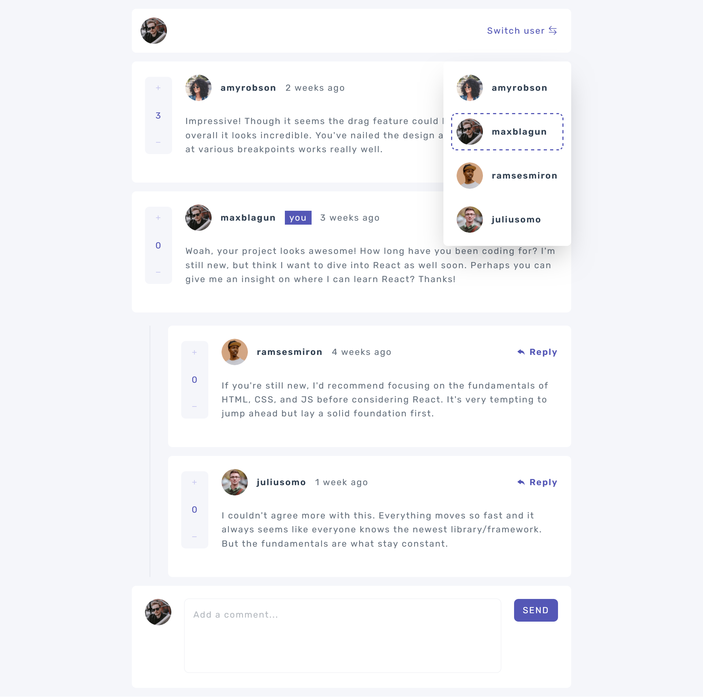
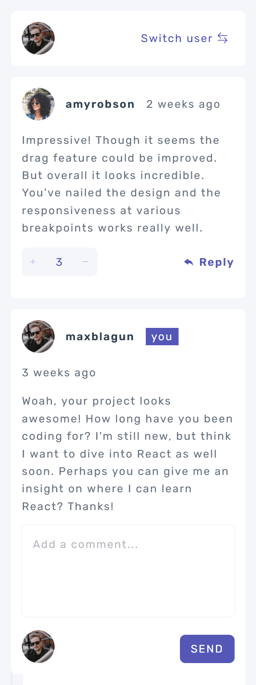

# Frontend Mentor - Interactive comments section solution

This is a solution to the [Interactive comments section challenge on Frontend Mentor](https://www.frontendmentor.io/challenges/interactive-comments-section-iG1RugEG9). Frontend Mentor challenges help you improve your coding skills by building realistic projects.

## Table of contents

- [Overview](#overview)
  - [The challenge](#the-challenge)
  - [Screenshot](#screenshot)
  - [Links](#links)
  - [Get up and running](#get-up-and-running-with-few-steps)
- [My process](#my-process)
  - [Built with](#built-with)
  - [What I learned](#what-i-learned)
  - [Continued development](#continued-development)
  - [Useful resources](#useful-resources)
- [Author](#author)
- [Acknowledgments](#acknowledgments)

## Overview

### The challenge

Users should be able to:

- View the optimal layout for the app depending on their device's screen size
- See hover states for all interactive elements on the page
- Create, Read, Update, and Delete comments and replies
- Upvote and downvote comments
- Use `localStorage` to save the current state in the browser that persists when the browser is refreshed.
- Dynamically track the time since the comment or reply was posted.
- Switch between user sessions

### Get up and running with few steps:

- Clone the repo
  ```bash
  git clone git@github.com:vickbk/interactive-comments-section.git
  ```
- Install the dependancies
  ```bash
  pnpm install
  ```
- Start the server
  ```bash
  pnpm dev
  ```
- Build a production preview
  ```bash
  pnpm build
  ```
- Preview the built file
  ```bash
  pnpm preview
  ```
- Run tests
  ```bash
  pnpm test
  ```

### Screenshot




### Links

- Solution URL: [Github Repo](https://github.com/vickbk/interactive-comments-section/)
- Live Site URL: [Github pages](https://vickbk.github.io/interactive-comments-section//)

## My process

### Built with

- Semantic HTML5 markup
- CSS custom properties
- Mobile-first workflow
- [SASS](https://sass-lang.com/) - CSS Preprocessor
- [Tailwindcss](https://tailwindcss.com/) - CSS framework
- [React](https://reactjs.org/) - JS library
- [Vite](https://vite.dev/) - A build tool for the web
- [Vitest](https://vitest.dev/) - A Next Generation Testing Framework

### What I learned

During this project I combined both TDD and unit first for test writting.
The TDD method was mostly used to integrate new functionalities such as voting, replying while I could get my self caught in the unit first when something was missing in the implementation.

I also added an intergration test that covers all the interactions on the component from switching accounts, adding and deleting comments and replies.

### Continued development

As I am getting familiar with testing I will continue adding it my existing projects to get the best of results.

### Useful resources

- [FEM Frontend Testing Introduction](https://www.frontendmentor.io/learning-paths/introduction-to-front-end-testing-kacF_IJQO5) - This helped me on understanding frontend testing and getting started
- [Roadmap.sh](https://roadmap.sh/react) - This React roadmap is helping in grasping react knowledge

## Author

- Github - [@vickbk](https://github.com/vickbk)
- Frontend Mentor - [@vickbk](https://www.frontendmentor.io/profile/vickbk)
- Twitter - [@Vick_bk8](https://x.com/Vick_bk8)

## Acknowledgments

For this project I use most of the knowlegde I got from the frontend roadmap, frontendmentor for HTML & css tricks and technics, accessibility and various developement techniques...
